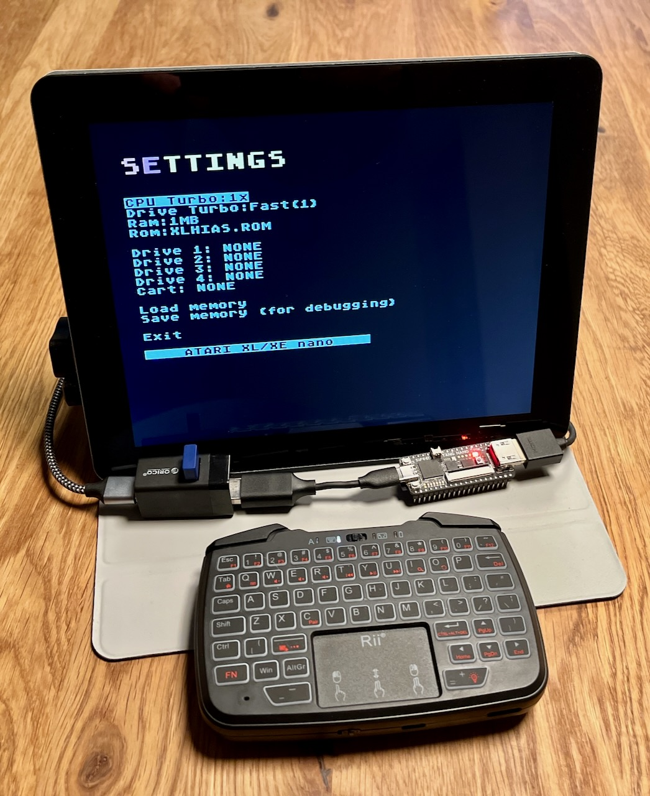

# Atari XL/XE on Tang Nano 20K (FPGA)

**Enhanced Atari XL/XE reimplementation for the Tang Nano 20K FPGA**  

This project brings the classic Atari XL/XE 8-bit computer family to the **Tang Nano 20K FPGA board**, offering a near-authentic experience on modern FPGA hardware.  

It is based on and inspired by earlier works, including:
- [AtlasFPGA/Atari800](https://github.com/AtlasFPGA/Atari800)  
- Component implementations by **Mark Watson**  
- Extensions and improvements contributed by **Woj**  

---

## Project Status

At this stage, the repository contains the FPGA bitstream and documentation.  
👉 **Source code will be added soon** (after cleanup and organization).  

---

## Getting Started

### 1. Flashing the FPGA
- On **Linux / macOS**, use [`openFPGALoader`](https://trabucayre.github.io/openFPGALoader/).  
- On **Windows**, use **GOWIN EDA**.  

Example command (Linux/macOS):
```bash
openFPGALoader A800nano.fs -f
```

### 2. Preparing the SD Card

- Format an SD card as FAT32.
- Create the following folder structure:
```bash
/atari800
   /rom
      ATARIBAS.ROM
      xlhias.rom
      [other optional ROMs...]
   /user
      mygame.atr
      demo.xex
      cartridge.car
      [other Atari software...]
```
### 3. **Place the required ROM files in the `/rom` folder:**  
   - `ATARIBAS.ROM` — Atari BASIC ROM  
   - `xlhias.rom` — default OS ROM with turbo disk support  

   You may also add additional ROM files and select them from the configuration menu.

**⚠️ Legal Notice:** These ROMs are copyrighted and are **not** included in this repository.  
You must provide your own legally obtained copies (e.g., by backing up your original hardware, or using open-source replacements such as AltirraOS).

### 4. **Place your Atari software in the `/user` folder.**  
   Supported formats: `.atr`, `.xex`, `.car`

---

## Controls

- **DEL** — Open configuration menu  
- **F5** — Start  
- **F6** — Select  
- **F7** — Option  
- **F10** — Reset  

---

## Peripheral Support

For connecting a **keyboard, joystick, or gamepad**, use [**FPGA Companion**](https://github.com/MiSTle-Dev/FPGA-Companion).  
- You can use the latest official release from the project website, or my updated build available under **Releases** (with extended gamepad support; source code coming soon).  
- The project supports both setups:
  - with **m0sdock**  
  - with the built-in **BL616**

---

## Screenshots

Here is the project running on Tang Nano 20K:



More screenshots and setup examples coming soon.

---

## License

This project is released under the **MIT License**.  
See the `LICENSE` file for details.

---

Enjoy reliving the Atari 8-bit era on your Tang Nano 20K!
